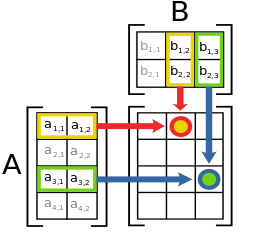
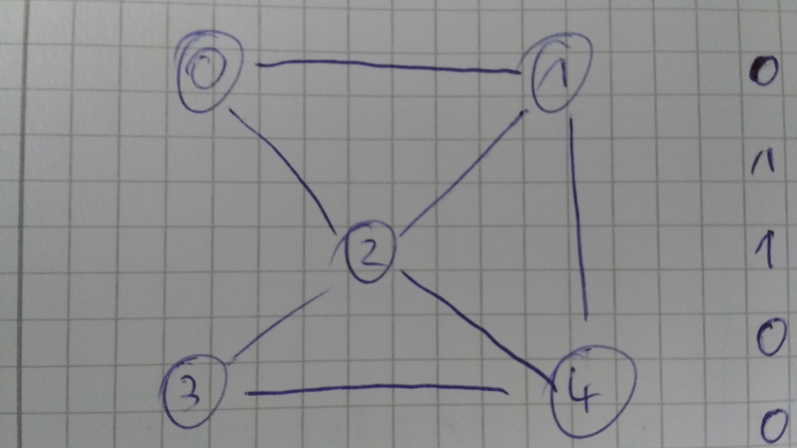
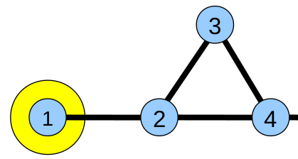
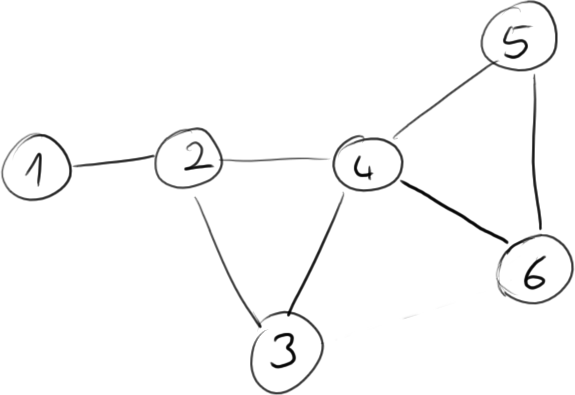
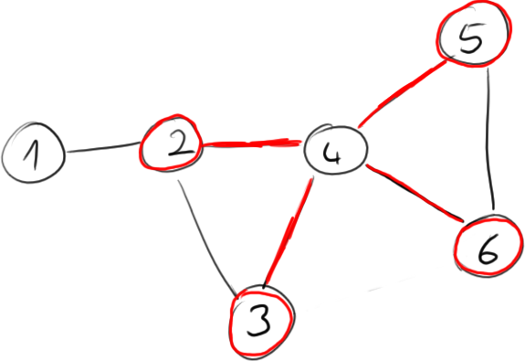
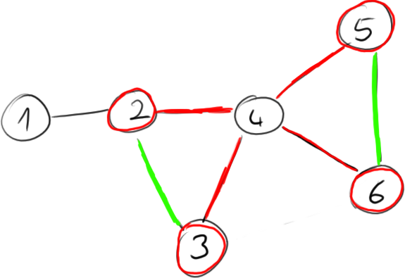
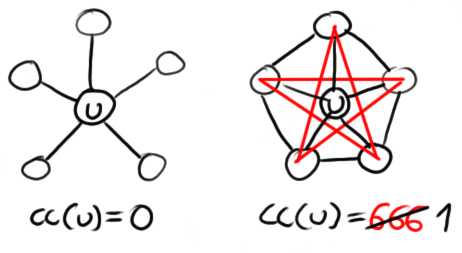

# Matrix Basics

A **matrix** is like a vector with two dimensions. The $m \times n$ matrix $A$ has $m$ rows and $n$ columns. $A_{i,j}$ refers to the value in the $i$th row and the $j$th column, based on $1$-indexing.

Unintuitive: rows and columns are in a different order than x and y coordinates would be. Also indexing isn't $0$-based, which is sick and wrong.

## Operations

**Transposing** a matrix ($A^T$) means to turn its rows into columns (or vice-versa). Formally, $A^T_{i,j} = A_{j,i}$. Also $A^{T^T} = A$.

**Scalar-on-matrix operations**, like $s \cdot A$ or $s + A$, operate on each element of the matrix. Hence, they “scale” the matrix. They act like other scalar operations would, so for example $s \cdot A = A \cdot s$.

**Matrix multiplication** are is complicated. A vector can be seen as a matrix with only one column, so the same rules apply. They don't act like scalar operations, so you can't reorder them, $AB \neq BA$.

You can multiply two matrices $A$ and $B$ if $A$ is an $m \times n$ matrix and $B$ is an $n \times k$ matrix. That is, $m$ and $k$ don't matter, but $n$ needs to be the same.

To multiply two matices on paper just write them down like in the figure:

{width="50%"}\

In the example above, the value for $AB_{1, 2}$ is $A_{1,1} B_{1,2} + A_{1,2} B_{2,2}$. So to find the value of a cell, you summarize the products of each pair, beginning on the left of the left matrix and on the top of the right/top matrix.

**Matrix exponentiation** works as expected: $A^n = \displaystyle{\prod_1^n} A = \underbrace{A A ... A}_{n\textmd{ times}}$.

## Properties

An $n \times n$ matrix is a **square matrix**. Every one of these has a **diagonal** at elements $a_{1,1}, a_{2,2} ... a_{n,n}$.

A square matrix where all elements that are not on the diagonal are zero is called **diagonal matrix**.

If all the elements in a diagonal matrix are $1$, then it's an **identity matrix**. Multiplying by it does nothing, much like $1$ in scalar multiplication.

A square matrix is **orthogonal** if $A^T A = A A^T = I$, where $I$ is the identity matrix appropriate for $A$'s dimensions.

## Eigen\*

Let $A$ be a square matrix.

The scalar $\lambda$ is an **eigenvalue** of $A$ if you can find a non-zero vector $x$ so that $Ax = \lambda x$.

$x$ is then the **eigenvector** of $A$ corresponding to $\lambda$. You can scale this vector by any $\alpha != 0$ and it remains an eigenvector.

To find those values you need the determinant, which we can't really calculate with our giant matrices. So hopefully we won't have to do that.a

Those are **right** eigenvectors. There's also **left eigenvectors** that use the formula $xA = \lambda x$ instead.

## Miscellaneous Gotchas

The **norm** or **length** of a vector $v$ is $||v|| = \sqrt{v_1^2 + v_2^2 + ... + v_n^2}$. Sometimes it's also written as $|v|$ because who even needs consistency.

A bold **1** is sometimes the vector $\left(\begin{matrix}1\\1\\\vdots\\1\end{matrix}\right)$ that is conveniently the right length for the current calculation. Analogous with **0**.

# Strong And Weak Ties

A **Bridge** is an edge connecting $u$ and $v$ whose removal would cause $u$ and $v$ to lie in two different connected components.

An edge joining two nodes $u$ and $v$ in a graph is a **Local Bridge** if its endpoints $u$ and $v$ have no friends in common. The **Span of a Local Bridge** is the distance its endpoints would be from each other if the edge was deleted.

**Strong Ties** and **Weak Ties** are special edges. If two nodes have a common neighbor connected by strong ties they must at least be connected by a weak tie themselves. This is called the **Triadic Closure Property**.

The **Betweenness** of an edge is the number of shortest paths in which it is contained.

# Degree Distribution

**Pareto Principle**: 20% of people create 80% of all dank memes.

A **Random Graph** has $n$ nodes and each possible edge exists with propability $p$.

The **Lorenz Curve** describes, for example, how wealth is distributed in the population. It represents statements like "80% of all rare pepes belong to the top 20% dankest people". The **Gini Coefficient** describes the percentage of the area above the Lorenz Curve compared to the whole area below the diagonal (which represents equality).

## Distributions:

* **Normal Distribution** $f(x) = e^{(-x^2/2)}$
* **Exponential Distribution** $f(x) = x^{constant}$
* **Power Law Distribution** $f(x) = constant^x$ Looks like a linear function on a log-log scale.

Many distributions IRL follow are power law distributions. For example, few languages are spoken by many people, but many languages are spoken by few people. One explanation for this is the **Rich Get Richer Model**, which states that power laws arise from the feedback introduced by correlated decisions since people tend to copy the decisions of people who acted before them (**Matthew Effect**). This causes an **Information Cascade**. For Marketing this means that there are two markets: One for "Hits" (few items that each sell a lot) and one for "niche products" (many items that each sell worse).

# Small Worlds Network

> A **Small-World Network** is a type of mathematical graph in which most nodes are not neighbors of one another, but most nodes can be reached from every other node by a small number of hops or steps.

In a social network most people have **Six Degrees Of Separation** between them, i.e. there are 6 other people between them and any other person, but most people only have a limited number of neighbors, thus social networks tend to be Small-World Networks.

**Global Clustering Coefficient**: Fraction of closed paths of length 2 (triangles) to number of paths of length 2. Low values indicate a tree-like network. **Local Clustering Coefficient**: Fraction of connected neighboring pairs of a node to number of neighboring pairs. The **Average Clustering Coefficient** averages the Local Clustering Coefficient. Small-World Networks have high Clustering Coefficients. A high number of **Triadic Closures** increases the Clustering Coefficient.

**The Erdős–Rényi Model**: Random Network where $n$ nodes have propability $p$ to be connected. Produces networks with small average distances and low clustering coefficients. **Lattices** are grid-like networks with long average distances and high Clustering Coefficients. The **Watts–Strogatz Model** adresses this problem by generating a netowk with high Clustering Coefficients and a power-law-like degree distribution. It works by creating a Ring Lattice and rewiring some of the edges ([detailed explanation on Wikipedia](https://en.wikipedia.org/wiki/Watts_and_Strogatz_model#Algorithm)).

# Centrality

* **Degree**: Number of Neighbors
* **Betweenness** (of an edge): Number of shortest paths in which it is contained.
* **Closeness**: Average distance to all other nodes.
* **Eccentricity**: Maximum distance to all other nodes. The **Diameter** of a graph is the maximum Eccentricity. The **Radius** of a graph is the minimum Eccentricity.
* **In-Degree** (directed graph):
* **Random Walk Centrality** (directed graph):
* **PageRank** (directed graph):
* **HITS** (directed graph):

## Eigenvector Centrality

Square matrices can be used to transform vectors. For every square matrix, there is a non-zero vector whose direction is not changed by the transformation. This is the **Eigenvector**, and the change in length is the **Eigenvalue** of the transformation matrix. Hence the formula $Av = \lambda v$ where $A$ is the matrix, $v$ the Eigenvector and $\lambda$ the Eigenvalue. For example:

$$
\left[\begin{matrix}
  2 & 1 \\
  1 & 2
\end{matrix}\right]
\left[\begin{matrix}
  3 \\
  -3
\end{matrix}\right]
=
1
\left[\begin{matrix}
  3 \\
  -3
\end{matrix}\right]
$$

The graph above has the adjacency matrix:

~~~octave
A = [
  [0, 1, 1, 0, 0],
  [1, 0, 1, 0, 1],
  [1, 1, 0, 1, 1],
  [0, 0, 1, 0, 1],
  [0, 1, 1, 1, 0]
]
~~~

Through some Octave Magic `[V, eigs] = eigs(A, 1)` we know A's largest eigenvector:

~~~
V =
  -3.5054e-01
  -4.6996e-01
  -5.5903e-01
  -3.5054e-01
  -4.6996e-01
~~~

Each element in that column tells us the "Centrality" of the corresponding node (in the example the node $2$ obviously has the highest Centrality).

This can also be calculated manually through the power-iteration:

~~~octave
power_v = ones(rows(A), 1);
e = 0.000001;
l = 0;

do
  power_v = A*power_v;
  l_prev = l;
  l = norm(power_v);
  power_v = power_v/l;
until (abs(l_prev - l) < e)
~~~

For the example above, this produces

~~~
power_v =
   0.35061
   0.46998
   0.55890
   0.35061
   0.46998
~~~

which is close enough.

## Random Walk

You know the concept of random walk so I won't explain it again. This section talks about directed graphs, but you can also use it on undirected graphs if you pretend that they're directed graphs with only symmetric edges.

Given is a square $n \times n$ adjacency matrix $A$. We'll use the above one, so $n$ is 5.

To calculate the centrality for all nodes in an adjacency matrix $A$, we first need their outgoing degree for each node. That's easy to calculate:

$$
d = A \textmd{\textbf{1}} = \left(\begin{matrix}
    0 & 1 & 1 & 0 & 0 \\
    1 & 0 & 1 & 0 & 1 \\
    1 & 1 & 0 & 1 & 1 \\
    0 & 0 & 1 & 0 & 1 \\
    0 & 1 & 1 & 1 & 0
\end{matrix}\right) \left(\begin{matrix}1\\1\\1\\1\\1\end{matrix}\right) = \left(\begin{matrix}
    2 \\
    3 \\
    4 \\
    2 \\
    3
\end{matrix}\right)
$$

Now $d_i$ is the degree of node $i$. Note that the lecture calls this $d_o$ instead of $d$, but subscripts are already used for indexing. Consistency and all that.

We then need the transition matrix $P$. It's defined as:

$$
P_{ij} = \left\lbrace \begin{matrix}
    \frac{1}{n} \textmd{ if } d_i = 0 \\
    \frac{1}{d_i} \textmd{ if } d_i > 0 \textmd{ and } A_{ij} \neq 0\\
    0 \textmd{ otherwise}\\
\end{matrix} \right.
$$

For our matrix, that is:

$$
P = \left(\begin{matrix}
    0 & \frac{1}{2} & \frac{1}{2} & 0 & 0 \\
    \frac{1}{3} & 0 & \frac{1}{3} & 0 & \frac{1}{3} \\
    \frac{1}{4} & \frac{1}{4} & 0 & \frac{1}{4} & \frac{1}{4} \\
    0 & 0 & \frac{1}{2} & 0 & \frac{1}{2} \\
    0 & \frac{1}{3} & \frac{1}{3} & \frac{1}{3} & 0
\end{matrix}\right)
$$

Somehow you can use this $P$ to compute stuff now.

## PageRank

Similar to Random Walk, but each node has a chance $\alpha$ to teleport to a random node.

Instead of $P$, you use the magical Google matrix $G$ and the identity matrix $I$ for $A$:

$$
G = (1 - \alpha) P + \frac{\alpha I}{n}
$$

# Link Prediction

... in social networks gives friends-recommendations and the likes. If $A$ is an adjacency matrix, $A^2$ contains the number of common friends of two nodes (and the number of neighbors on the diagonal).

For the graph above, this means:

$$
A^2=
\left(\begin{matrix}
  0 & 1 & 0 & 0 \\
  1 & 0 & 1 & 1 \\
  0 & 1 & 0 & 1 \\
  0 & 1 & 1 & 0
\end{matrix}\right)^2
=
\left(\begin{matrix}
  1 & 0 & 1 & 1 \\
  0 & 3 & 1 & 1 \\
  1 & 1 & 2 & 1 \\
  1 & 1 & 1 & 2
\end{matrix}\right)
$$

For example, based an this, a friendship between $1$ and $3$ would be suggested, because $A^2_{1,3} \geq 1$.

Generally, $A^n$ contains the number of paths with length $n$ between two nodes:

$$
A^3=
\left(\begin{matrix}
  0 & 3 & 1 & 1 \\
  3 & 2 & 4 & 4 \\
  1 & 4 & 2 & 3 \\
  1 & 4 & 3 & 2
\end{matrix}\right)
$$

For example the 3 (=$A^3_{1, 2}$) paths of length 3 between $1$ and $2$ are $\{1\rightarrow2\rightarrow1\rightarrow2, 1\rightarrow2\rightarrow3\rightarrow2, 1\rightarrow2\rightarrow4\rightarrow3\}$.

# Game Theory

Examines situations where the outcome for one person depends both on their and other people's choices. A **Game** has a set of **Players**. (Stepwise,) Players simultaniously choose **Strategies** and receive **Payoffs**. A Game is completely defined by a **Payoff matrix**, for example the Payoff Matrix of the stupid Ultimatum Game from the slides is:

| Player1/Player2 | Accept | Reject |
| --------------- | ------ | ------ |
| Give 0          | (5,0)  | (0,0)  |
| Give 1          | (4,1)  | (0,0)  |
| Give 2          | (3,2)  | (0,0)  |
| Give 3          | (2,3)  | (0,0)  |
| Give 4          | (1,4)  | (0,0)  |
| Give 5          | (0,5)  | (0,0)  |

> The slides say that *Give 1/Accept* is "the best strategy" but I don't see why, since all payoffs in the *Accept*-column sum up to 5 and also why is a strategy suddenly a pair of "choices" and not just a "choice"?
>
> -- Marcő

That's because the example is bad, it's not actually a simultaneous choice. Player 1 chooses an amount and Player 2 decides *afterwards* if they want to accept or reject. Example broken.

However, you can still reason about this. All players are omniscient, even about each other. They also behave “rationally”, i.e. their prime directive is to optimize their own gain and their secondary objective is to minimize their opponent's gain (unless it's a collaborative game, but whatever).

If Player 1 gives 0, Player 2 can't optimize their own gain, so they will fall back to minimizing their opponent's game, leading to a rejection. If Player 1 gives them any other amount, they will accept, because rejecting would compromise the prime directive.

Because of their omniscience, Player 1 *knows* that Player 2 will respond like this, so giving 1 is obviously the best option.

If Player2 chooses a strategy $T$, $S$ is the **(strict) best response** if it's payoff is better (strictly better) than every other response:

$$
\forall_{S'\setminus\{S\}}: P_1(S, T) \geq P_1(S', T)
$$

$P_1$ denotes the payoff for Player 1. A **Dominant Strategy** for Player 1 is a best response to every strategy of Player 2:

$$
\forall_{S'\setminus\{S\}, T}: P_1(S, T) \geq P_1(S', T)
$$

A **Nash Equilibrium** is a pair of strategies that are best responses to each other. There can be multiple Nash Equilibria in one game. For example, when two people chose between two incompatible software alternatives, chosing the same alternative are Nash Equilibria.

| A/B        | MSOffice | OpenOffice |
| ---------- | -------- | ---------- |
| MSOffice   | (1, 1)   | (0, 0)     |
| OpenOffice | (0, 0)   | (1, 1)     |

An outcome of a game is **Pareto Optimal** if there is no way to increase the total payoff without reducing the payoff of an individual. A pair of strategies is **dominated** by another pair if the above is true. $(S,T)$ is dominated by $(S',T')$ if:

$$
P_1(S') > P_1(S) \land P_2(T') \geq P_2(T) \lor P_1(S') \geq P_1(S) \land P_2(T') > P_2(T)
$$

If a player only plays one strategy, he is playing a **Pure Strategy**. If he chooses the strategy at random, he is playing a **Mixed Strategy**. If all players play a Pure Strategy and a Nash Equlibrium, this is called **Pure Strategy Nash Equilibrium**.

## Example

In exercise 7, we have this here payoff matrix:

|            | Player1: A | Player1: B | Player1: C |
| ---------- | ---------- | ---------- | ---------- |
| Player2: A | (4, 2)     | (5, 1)     | (3, 0)     |
| Player2: B | (3, 2)     | (4, 4)     | (1, 0)     |
| Player2: C | (2, 3)     | (4, 2)     | (3, 2)     |

First off, we'll need the best responses for both players. For that I have developed a response matrix notation, patent pending.

| Player 2 picks | Best responses for Player 1 |
| -------------- | --------------------------- |
| A              | B                           |
| B              | B                           |
| C              | B                           |

| Player 1 picks | Best responses for Player 2 |
| -------------- | --------------------------- |
| A              | C                           |
| B              | B                           |
| C              | C                           |

In this case, all best responses also happen to be strictly best responses. It should also be obvious that Player 1 has a dominant strategy of just B every round.

It's also clear from these that B/B is a Nash Equilibrium, because they are best responses for each other.

For the Pareto Optimum, we'll just walk through the matrix and look at every value and look for another value that would improve upon it without reducing any one player's payoff:

1. (4, 2): not optimal, (4, 4) is better
2. (5, 1): **optimal**
3. (3, 0): not optimal, (5, 1) is better
4. (3, 2): not optimal, (4, 2) is better
5. (4, 4): **optimal**
6. (1, 0): not optimal, (3, 0) is better
7. (2, 3): not optimal, (4, 4) is better
8. (4, 2): see 1.
9. (3, 2): see 4.

# Markets

A **Market With Exogenous Events** is a Market where events are not influenced by price formation in the market (e.g. bets on sports do not change the players' performance), unlike an **Market With Endogenous Events**, where the market influences events (e.g. success of a company depends on its stock prices).

The **Utility** of a thing is its subjective value. It is modeled by a **Utility Function**, a sublinear function that is strictly monotically decreasing, like $U(w) = \sqrt{w}$, where $w$ is the monetary value.

> Because having two million Euro is not twice as useful as having one million Euro!

**Odds**-Betting: An Event has the odds $o_X$ (odds as in "4:1" odds to win) and you bet $m$ moneyz. Winners receive $o_X m$ moneyz.

*Bettig Strategy stuff omitted.*

**Prediction Markets** synthesize idividual believs into predictions.

# Signed Networks

**Signed Networks** have positive and negative edges, for exaple "likes" and "dislikes" in a social network. Most of them are directed. They are **symmetric** if an edge in one direction implies the same edge in the other direction, and **skew-symmetric** if the opposite edge is implied.

There can be **Conflict Triangles**, for example if two persons like the same person and dislike each other. Were the two persons to like each other, the triangle would be **balanced**. A signed network is **weakly balanced** if all its triangles are balanced and **strongly balanced** if some fucking condition that I do not understand is met.

Signed Networks have normal Adjacency Matrices with the addition of $-1$ to represent negative edges.

**Collaborative Filtering** can be used to predict product ratings in bipartite signed networks:

$$
r(u, i) = \frac{\sum_{v\in V} sim(u,v) r(v,i)}{\sum_{v\in V} sim(u,v)}
$$

where $r(u, i)$ is the predicted rating of product $i$ by user $u$, $V$ are all other users and $sim(u, v)\in [0,1]$ is the similarity of two users.

# Clustering

## Local Clustering Coefficient

Take this graph here:

We'll look at the clustering coefficient of Node 4, which we'll now call $u_4$.

First off, figure out which nodes are neighbors of $u_4$.

It's connected to $u_2$, $u_3$, $u_5$ and $u_6$. That means its degree $d(u_4) = 4$.

Then count the number of connections between the neighbors of $u_4$:

It doesn't seem like the lecture gives any name to this, so I'll just call it $p(u_4) = 2$, because it's Pairs.

Now we can calculate the local clustering coefficient via the formula $cc(u) = \frac{2 p(u)}{d(u) (d(u) - 1)}$:

$$
cc(u_4) = \frac{2 p(u_4)}{d(u_4) (d(u_4) - 1)} = \frac{2 \cdot 2}{4 \cdot (4 - 1)} = \frac{4}{12} = \frac{1}{3}
$$

The result will always be $0 \leq cc(u) \leq 1$. The extreme values are shown here:

## Global Clustering Coefficient

Calculate the local clustering coefficient for all $u \in G$. Then average them.

# Auctions

* **Sealed-Bid Auction**: Each buyer gets one (secret) bid and the highest bid wins
  * **Second-Price Sealed-Bid Auction/Vickrey Auction**: The winner pays the second-highest price that was bid
  * **First-Price Sealed-Bid Auction**: The winner has to buy at his price
* **English Auction**: Buyers outbid each other
* **Dutch Auction**: Seller decreases price until one buyer buys
* **Reverse Auction**: Many sellers, one buyer, the lowest price wins (can be applied to English and Dutch auctions)

The **valuation** is the maximum amount a buyer is willing to bid. The valuation is modeled as the actual worth of an item plus an error term. Bidding below one's valuation to counter this **Winner's Curse** is called **Bid Shading**.

*Marked Matching stuff omitted since that looks really hard and is likely not relevant*.

# Cascading

People in a network influence by their actions (but not their knowledge). This can cause **cascading effects** through the network, for example in making a particular book really popular or in adopting new technologies. Initial **shocks** are based on personal information, but later people may ignore their knowledge and "follow the crowd".

*Not going into detail here because of irrelevance and previous exposure*.

# Network Effects

An **Externality** is a situation where an individual is affected by other individuals.

*WHAT THE FUCK IS GOING ON*.
