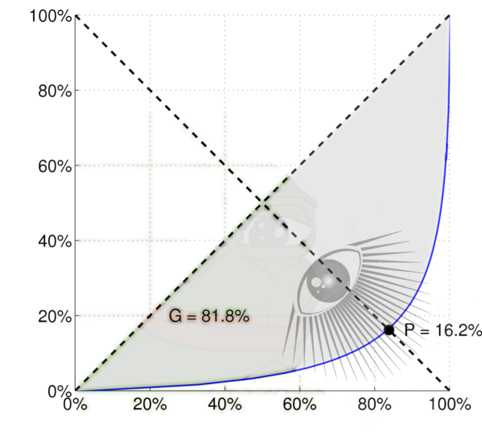

# Strong And Weak Ties

A **Bridge** is an edge connecting $$u$$ and $$v$$ whose removal would cause $$u$$ and $$v$$ to lie in two different connected components.

An edge joining two nodes $$u$$ and $$v$$ in a graph is a **Local Bridge** if its endpoints $$u$$ and $$v$$ have no friends in common. The **Span of a Local Bridge** is the distance its endpoints would be from each other if the edge was deleted.

**Strong Ties** and **Weak Ties** are special edges. If two nodes have a common neighbor connected by strong ties they must at least be connected by a weak tie themselves. This is called the **Triadic Closure Property**.

The **Betweenness** of an edge is the number of shortest paths in which it is contained.

# Degree Distribution

**Pareto Principle**: 20% of people create 80% of all dank memes.

A **Random Graph** has $$n$$ nodes and each possible edge exists with propability $$p$$.

The **Lorenz Curve** describes, for example, how wealth is distributed in the population. It represents statements like "80% of all rare pepes belong to the top 20% dankest people". The **Gini Coefficient** describes the percentage of the area above the Lorenz Curve compared to the whole area below the diagonal (which represents equality).

## Distributions:

* **Normal Distribution** $$f(x) = e^(-x^2/2)$$
* **Exponential Distribution** $$f(x) = x^constant$$
* **Power Law Distribution** $$f(x) = constant^x$$ Looks like a linear function on a log-log scale.

Many distributions IRL follow are power law distributions. For example, few languages are spoken by many people, but many languages are spoken by few people. One explanation for this is the **Rich Get Richer Model**, which states that power laws arise from the feedback introduced by correlated decisions since people tend to copy the decisions of people who acted before them (**Matthew Effect**). This causes an **Information Cascade**. For Marketing this means that there are two markets: One for "Hits" (few items that each sell a lot) and one for "niche products" (many items that each sell worse).

# Small Worlds Network

In a social network most people have **Six Degrees Of Separation** between them, i.e. there are 6 other people between them and any other person.

# Centrality

# Link Prediction

# Game Theory

# Markets

# Signed Networks

# Clustering

# Auctions

# Cascading

# Network Effects
